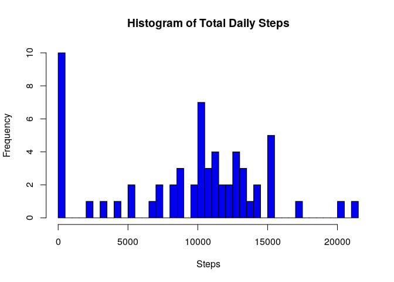
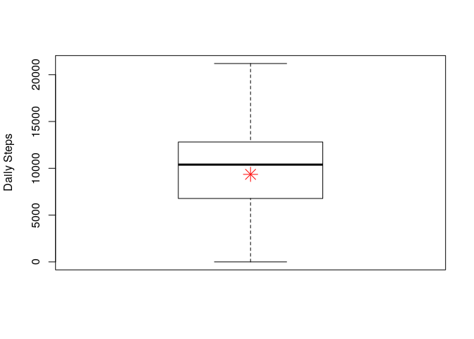
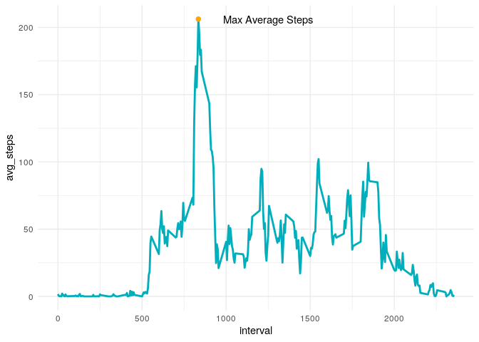
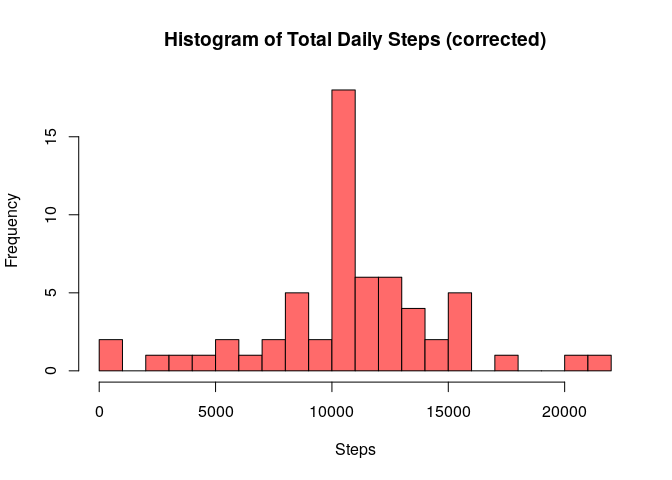
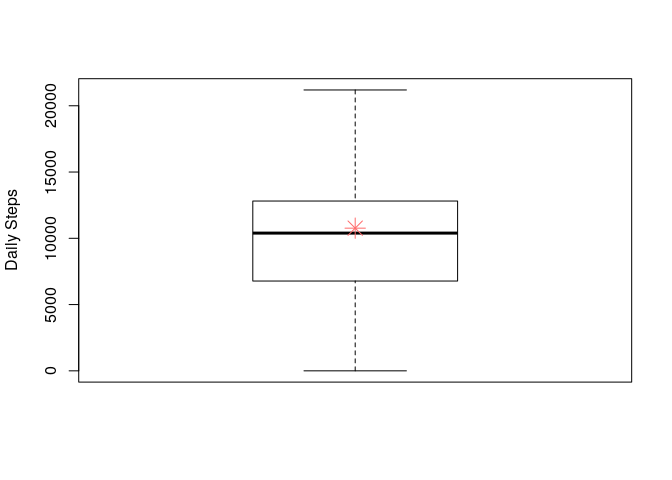
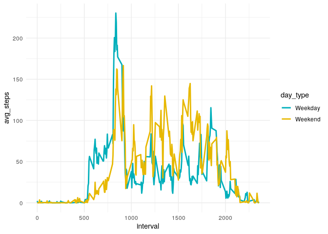

# Introduction

This submission summarizes the exploration of fitness activity data. The dataset was provided as part of the previous clone of this repo. The data was explored by answering the  questions below with methodology, code, and results immediately following.

Note: This script requires the user to work from a prepared directory with all files preloaded using the command setwd("./Projects/Reproducible_Data/Week_2/RepData_PeerAssessment1")

## Loading and preprocessing the data

First, install all requisite libraries and read in the base dataset required to answer the data questions.


```r
library(dplyr, warn.conflicts=F, quietly=T) # load tidydata library
library(ggplot2) # load tidy grphics library
theme_set(theme_minimal())
# setwd("./Projects/Reproducible_Data/Week_2/RepData_PeerAssessment1") # set working directory
zipFile<- "./activity.zip"
outDir<-"./"
# unzip(zipFile,exdir=outDir)
df <- read.csv("./activity.csv") #upload base data frame to the workspace
```

## What is mean total number of steps taken per day?
To answer this question, we must process the base data frame to group by date and then perform a summrized sum function of all steps recorded each day. 

**Note:** There were multiple observations in the base data fram (5-minute interval summary) that contained missing vales in the *steps* variable. These missing values were handled by omitting them the processed data frame.

The resulting data frame is entitled **df_steps** - which contains 61 unique observations (daily step totals). Is is evident from the histogram that many dates have step totals that are centered around about 10,000 steps, but there a significant number of days that have no steps recorded at all. A box plot is constructed to display the quantile data with the mean as an overlay. 

```r
# process data frame
df_steps <- df %>% group_by(date) %>% summarize(daily_steps = sum(na.omit(steps))) 
# Generate histogram displaying total steps per day
hist(df_steps$daily_steps, col="blue2", main="Histogram of Total Daily Steps", 
     xlab="Steps", breaks = 35)
```

<!-- -->

```r
# Generate Box plot to display mean and median of the total daily steps
M = mean(df_steps$daily_steps)
format(M, digits=2, nsmall=2)
```

```
## [1] "9354.23"
```

```r
boxplot(df_steps$daily_steps, ylab="Daily Steps", xlab="")
points(M, col="red", pch= 8, cex=2)
```

<!-- -->
As expected, the median is about 10,000 steps per day, but the mean value is 9354.23, a slightly lower number.

## What is the average daily activity pattern?
To visualize the average daily activity pattern, the base data frame will need to be spliced into days, whereby each 5 minute interval in a given day can be summed and averaged against that same interval across all 61 days captured in the dataset. A time series plot can then be gereated to display time interval vs average steps. 


```r
# process data frame
df_interval <- df %>% group_by(interval) %>% summarize(avg_steps = mean(na.omit(steps)))
# identify maximum data point
highlight_pt <- df_interval %>% filter(avg_steps == max(avg_steps))
# Generate time series plot
# Basic line plot
ggplot(data = df_interval, aes(x = interval, y = avg_steps))+
  geom_line(color = "#00AFBB", size = 1) +
  geom_point(data=highlight_pt, aes(x= interval,y= avg_steps), 
             color='orange',size=2) +
  annotate("text", x = 1250, y = 206, label = "Max Average Steps")
```

<!-- -->

The maximum average number of steps is highlighted in the plot and is found to be 206.17, ocuring at about 13:55 on an average day.

## Imputing missing values

As alluded to earlier, there were several missing values that were omitted from the dataset to permit analysis. The missing values are prevalent in the *steps* variable and is calcuted in the code chunk below. The number of missing values found is a significant number, and could introduce bias in our findings. One methodology that I implemented to fill in these missing values to replace NAs with the daily step average for a given 5 min interval. After reevaluating the histogram and box plot of the number of steps taken per day, we find that the instances of zero-step days is significantly reduced and the computed mean is much closer than the median.


```r
## Imputing missing values
# Calculate and report the total number of missing values in the dataset
tot_NAs <- count(df,is.na(steps))$n[2]
# Replace the NAs in the steps variable
df_correct <- df %>% mutate(avg_step = rep(df_interval$avg_steps, length.out = length(df$interval)))
corr_step <- if_else(is.na(df_correct$steps), df_correct$avg_step, as.numeric(df_correct$steps))
df_correct <- mutate(df_correct, c_steps = corr_step)
df_correct <- df_correct %>% select(c_steps,date,interval)
# process data frame
df_c_steps <- df_correct %>% group_by(date) %>% summarize(daily_steps = sum(c_steps)) 
# Generate histogram displaying total steps per day
hist(df_c_steps$daily_steps, col="indianred1", main="Histogram of Total Daily Steps (corrected)", 
     xlab="Steps", breaks = 20)
```

<!-- -->

```r
# Generate Box plot to display mean and median of the total daily steps
M = mean(df_c_steps$daily_steps)
boxplot(df_steps$daily_steps, ylab="Daily Steps", xlab="")
points(M, col="indianred1", pch= 8, cex=2)
```

<!-- -->


## Are there differences in activity patterns between weekdays and weekends?

To evaluate differnces in activity pattern between weekends and weedays, the previous data frame will need to modified to add factorizarion for weekdays and weekend categories. The relevant code is outlined below.

```r
df_correct <- df_correct %>% mutate(day_ = weekdays(as.Date(date))) %>% 
  mutate(day_type = if_else(((day_ == ("Saturday"))|(day_ == ("Sunday"))), "Weekend", "Weekday"))
df_c_interval <- df_correct %>% group_by(interval,day_type) %>% summarize(avg_steps = mean(c_steps))
```
A time series plot can now be generated to compare weekday and weekend activity. At a cursory glance, it seems that peak steps are generated on weekdays, while there is more sustained activity prevalent on the weekends.

```r
# Multiple line plot
ggplot(df_c_interval, aes(x = interval, y = avg_steps)) +
  geom_line(aes(color = day_type), size = 1) +
  scale_color_manual(values = c("#00AFBB", "#E7B800"))
```

<!-- -->
